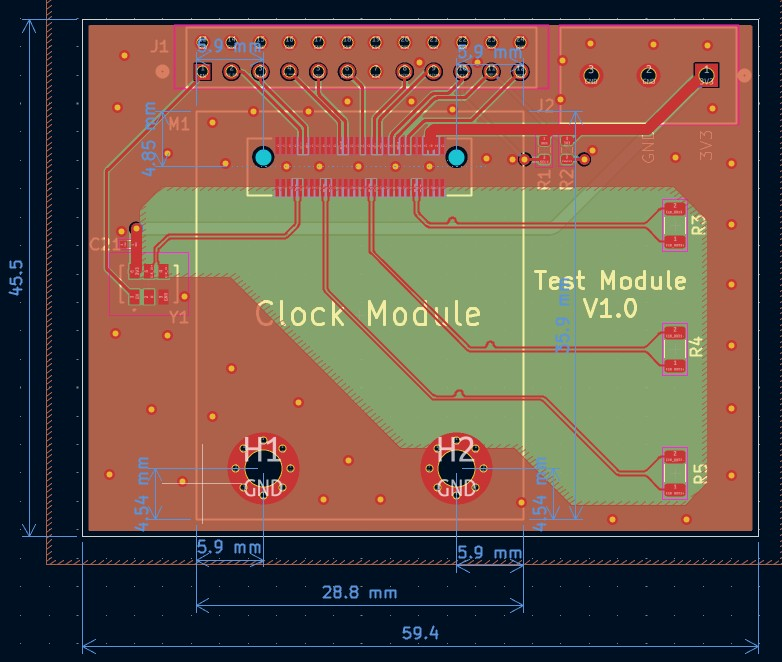
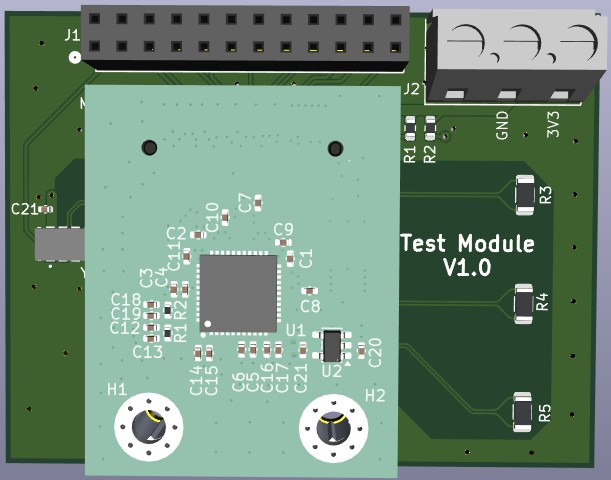

# mdc-test-board-clock-module
Modular Detector Controller Test Board Clock Module

## Overview
Test board for the `mdc-clock-module`. Provides a 10 MHz LVDS oscillator to drive the clock module input and validate jitter-cleaned outputs.

## Key Components
- 10 MHz LVDS oscillator: `Y1` (REN XL series)
  - LVDS output option with low phase jitter, suitable for reference clock injection.

## Control Interface
- Programmable via external 3.3V microcontroller using SPI or I2C.

## Board Dimensions
- 59.4 mm x 45.5 mm

## Files
- Schematic: `test_board_clock_module.pdf`

## Images
Layout:

3D view:

